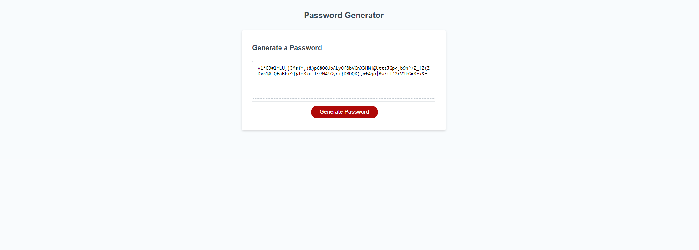

# key-gen



## Description

Building this key-gen provides good secuirty to unauthorized personnel to our clientele and stoping
intruders from stealing there personal information. The stronger the password the harder
it is for hackers to access your account.

## Installation

git clone git@github.com:byunn90/key-gen.git

## Build With

HTML
CSS
Javascript

## Usage

To add a screenshot, create an assets/images folder in your repository and upload your screenshot to it. Then, using the relative filepath, add it to your README using the following syntax:

```md

```

## Contact

https://github.com/byunn90

kayhanturk90@Live.com -->
